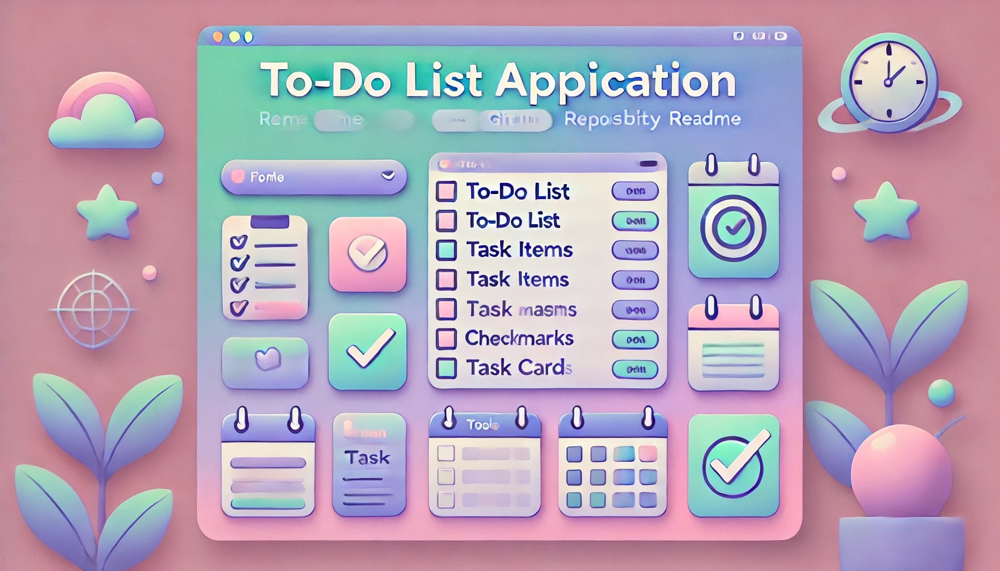

# PERSONAL TODO APP

## About

This is a classic to-do app initially developed as part of The Odin Project module. Finding it useful for my personal use, I have packaged it as a desktop application, intending to enhance its functionality based on my evolving needs.

## Release 1.0.0 - Initial Preview

https://github.com/ibrahimcode85/todo_app/releases/tag/v1.0.0
This release includes all the basic features to create to-do cards, presented on a dashboard categorized by their broad status: Planned, In Progress, or Completed.

### Getting Started

- Download the application zip file `todo-app-win32-x64.zip` from the release section. Run the `todo_app.exe` file to start.
- Using the application is intuitive:
  1. Click `Add Task Card` in the navigation bar to start adding cards. Fill in the required information such as `task name`, `project name`, `person-in-charge`, `due date`, and `status`.
  2. Once a task card is created, you can delete the card, upgrade its priority, downgrade its priority, or change its status.
  3. Click `Clear All Cards` in the navigation bar to remove all cards from the dashboard.
  4. Use `Filter Cards` to filter based on `project name` or `person-in-charge`.

## Future Enhancement Roadmap

- [ ] Add alerts on task cards when the due date is approaching.
- [ ] Enable exporting the dashboard to Excel.
- [ ] Modernize the overall dashboard layout of the app.

## Feedback

I created this application as a hobby. but I welcome any feedback to improve it or reports of any bugs or issues you encounter.
